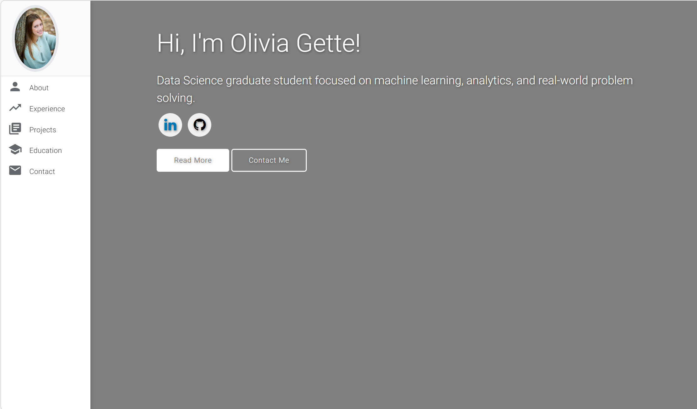

# Welcome to My Portfolio!

### Website Preview

 
  <kbd>
    
  </kbd>

## Connect With Me

  
  
  
  <!--  -->

## About Me

I am a graduate student at Michigan Technological University pursuing my M.S. in Data Science. I have experience in machine learning, data analytics, and building data-driven solutions across a range of applications, including healthcare, geographic infoprmation systems, and sensor-based systems. As a student-athlete, I bring strong discipline, teamwork, and leadership to my work, along with a passion for solving complex problems through data.

I am currently seeking full-time opportunities beginning in May 2027 where I can apply data-driven insights to impactful projects.

## Skills

- **Languages**: Python, SQL, R, Java, SAS, Bash, Julia, C
- **Data Analysis Tools**: TensorFlow, PyTorch, scikit-learn, Spark, Hadoop, Pandas, Seaborn, Matplotlib, NumPy
- **Development Tools**: Git, Linux, JupyterLab
- **Specialized Skills**: Machine Learning, Statistical Modeling, Algorithm Design

## Projects Showcase

### [Spark-Based CNN for Pneumonia Detection in Chest X-Rays](https://github.com/omgette/finalProject)
This project implements a distributed deep learning pipeline using Apache Spark to classify chest X-ray images as pneumonia or normal.

    

